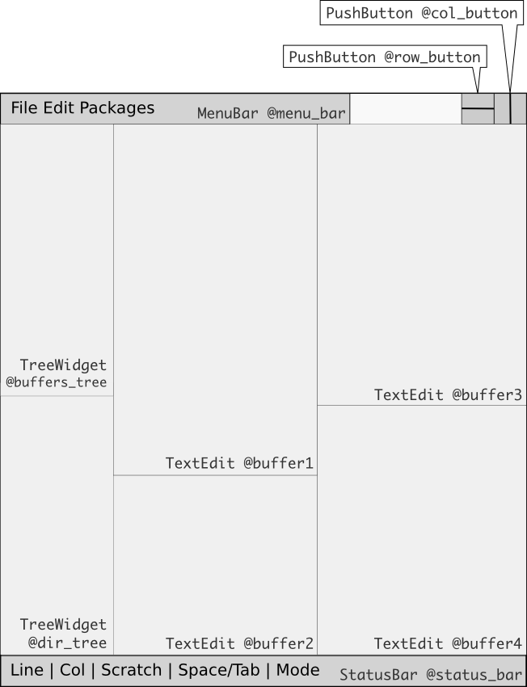
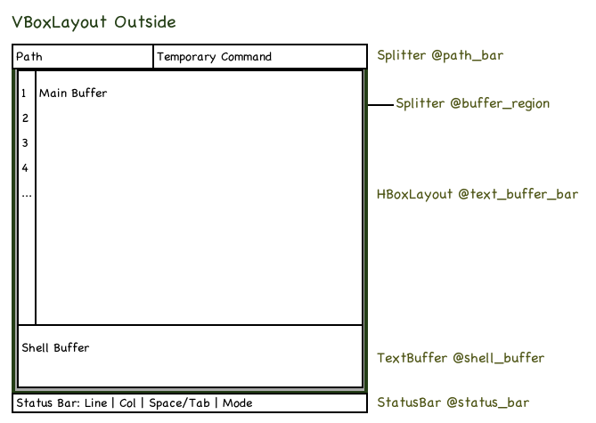

## Quick notes

* From time to time I find out that for each file I'm editting I need a shell associated with it.  So I added `shell_buffer` to each TextEdit to serve that purpose:

  - At first, the current working dir of the `shell_buffer` is the path of the text buffer associated with it.

  - User can change its working dir anytime just by `cd` or `chdir` or `change_dir` or `!cd`.

### Purposes & design philisophy

* *Espada* itself is a full-feature Ruby environment, designed specifically for *text processing* and *shell interacting*, so **\[DISCUSS\]** all convenient functions (`create_dir`, `save`, ...) are in global model (`Kernel`).

* "When in doubt, leave it out!"

* Syntactic sugar is one of user's best friends.  E.g. `create_dir` and `mkdir`, ...

## Running/testing notes:

* Working directory must always be `./src/`.  **Subject to change.**

* The unique`Qt::Application` instance must be named `App`.

## Application instance: `App`

* Each text buffer is stored in the hashtable `App.text_buffers` as a pair `(text_buffer.object_id => text_buffer)`.

* Current buffer is determined by `App.current_buffer`, which in turns, depending on `App.current_buffer_id`.  Whenever a text buffer receives focus, `App.current_buffer_id` changes appropriately.

* The Espada application when running would have a global singleton `App` representing all resources of the app.

## `MainWindow` widget

The `MainWindow` is the window that contains:

* The default global menu bar.

* A `TreeView` displaying current working directory.

* All editing `TextEdit`s.

* The status bar.

`MainWindow` mockup:

<div style="align: center; text-align: center">
    <br />
    Main Window mockup
</div>

## `KeyBinding` and `BindingTable` class

A keybinding is a way to map a key combination with a function, thus a keybinding consists of 3 parts:

* A key combination, managed by `KeyCombination` class
* A mode in which the key combination is activated
* And an action which will be performed when the key combination is pressed

There are 2 kinds of keybinding:

* Mode-specific binding: the keybinding only affects in certain mode.
* Global binding: is a special case where mode-specific keybinding takes the `global` parameter.

Mode-specific binding has *higher priority* than global binding.

If users want to manually bind keys, use the `.json` files from the configuration directory (TODO), do *not* use Ruby code unless you have clear reason to do so.

### Classes and their uses

* The `KeyCombination` class is a subclass of `Hash`, taking care of one key combination, e.g. "<ctrl> s".

* The `KeyBinding` class is a subclass of `Hash` and takes care of *one* keybinding, i.e. one key combination + the mode in which it's activated + its action.

* The `BindingTable` is a singleton, used to take care of *all* current keybindings, including mode-specific keybindings (TODO: more on that later).

### "Talk is cheap, show me the code"

How keybinding works internally:

* KeyCombination constructor:

    ```ruby
    save_s = KeyCombination.new("<ctrl s>")                      # Recommended way

    save_s_2 = KeyCombination.new({ :modifiers => [ :Control ],
      :key => :Key_S
    })                                                           # Direct way, not recommended
    ```

* KeyBinding constructor:

    ```ruby
    # The following lines do the same thing

    ctrl_s_save = KeyBinding.new("<ctrl> s", "save")

    KeyBinding.new("<ctrl> s", "save", :global)

    KeyBinding.new("<ctrl> s", Proc.new { save })                # Recommended

    KeyBinding.new("<ctrl> s", Proc.new { save }, :global)       # Also recommended

    KeyBinding.new(ctrl_s, "save")                               # Helper, use internally

    KeyBinding.new(ctrl_s, "save", :global)                      # Helper, use internally

    KeyBinding.new(ctrl_s, Proc.new { save })                    # Helper, use internally

    KeyBinding.new(ctrl_s, Proc.new { save }, :global)           # Helper, use internally

    ctrl_s_save.to_s
    # { :keys => ..., :action => ..., :mode => ... }
    ```

To add a new keybinding into the `BindingTable`, i.e. activating the keybinding: `a_binding.register(mode)`.  Internally, the `register` method will call `BindingTable.update(a_binding, mode)` to update the binding table.

To remove a keybinding from the `BindingTable`, i.e. deactivating the keybinding: `a_binding.unregister(mode)`.  Internally, the `unregister` method will call `BindingTable.remove(a_binding, mode)` to update the binding table.

The `mode` parameter is always optional and will take the default value of `:global`.

To rebind, simply add the keybinding again.

**Notes:** Quick way to create a keybinding and register: `bindkey("<ctrl> s", Proc.new { save }, :global)`.

## `TextEdit` widget

A `TextEdit` is also known as a *text buffer* or simply *buffer*.  When a buffer is destroyed, the garbage collection is trigger to save memory.

Each `TextEdit` widget contains:

<div style="align: center; text-align: center">
    <br />
    Text Buffer mockup
</div>

    # TextEdit

    VBoxLayout @layout
    |
    |--Splitter @path_bar
    |  |
    |  |--Icon @handler_icon
    |  |
    |  |--Label @path_entry
    |  |
    |  `--Label->Entry @cmd_entry
    |
    `--Splitter @buffer_region
       |
       |--HBoxLayout @text_buffer_bar
       |  |
       |  |--(?) (Line Number)
       |  |
       |  `--TextBufferWidget @buffer
       |
       `--TextBufferWidget @shell_buffer
    

The `TextEdit` widget is aware of the global app instance via its property `app`.

Each `TextEdit` has a 16x16 handler icon at the top-left corner.

## `EntryLabel` widget

`EntryLabel` widget is a `Label` which could be transformed into an `Entry`.
