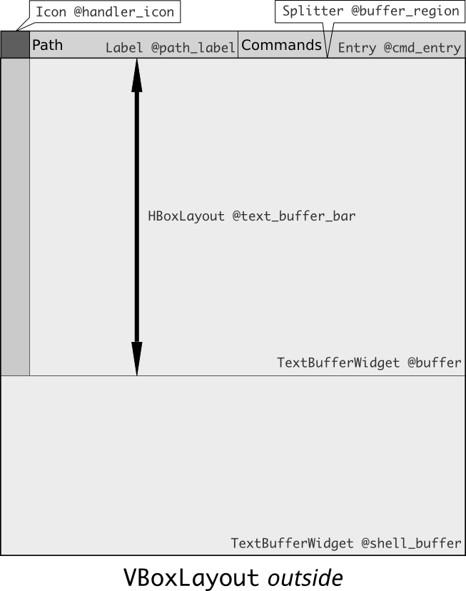

## Quick notes

## Running/testing notes:

* Working directory must always be `./src/`.  **Subject to change.**

* The unique`Qt::Application` instance must be named `App`.

## Application instance: `App`

* Each text buffer is stored in the hashtable `App.text_buffers` as a pair `(text_buffer.hash => text_buffer)`.

* Current buffer is determined by `App.current_buffer`, which in turns, depending on `App.current_buffer_hash`.  Whenever a text buffer receives focus, `App.current_buffer_hash` changes appropriately.

* The Espada application when running would have a global singleton `App` representing all resources of the app.

## `TextEdit` widget

Each `TextEdit` widget contains:

     
    Text Buffer mockup

    # TextEdit

    VBoxLayout @layout
    |
    |--HBoxLayout @path_bar
    |  |
    |  |--Label->Entry @path_entry
    |  |
    |  `--Label->Entry @cmd_entry
    |
    |--HBoxLayout @text_buffer_bar
    |  |
    |  |--(?) (Line Number)
    |  |
    |  `--TextBufferWidget [self]
    |  
    |--TextBufferWidget @directory_buffer
    |
    `--StatusBar @status_bar

The `TextEdit` widget is aware of the global app instance via its property `app`.

## `EntryLabel` widget

`EntryLabel` widget is a `Label` which could be transformed into an `Entry`.
